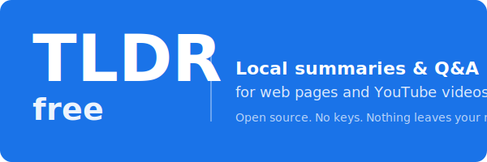

<p align="center">
  
</p>

<p align="center">
  <strong>Local summaries and Q&amp;A for web pages and YouTube videos.</strong><br/>
  Open source. No API keys. Nothing leaves your machine.
</p>

---

TLDR is a Chrome side-panel extension plus a small FastAPI daemon. Click the
toolbar button on any page or YouTube video and you get a streaming summary
with clickable `[MM:SS]` timecodes, plus a chat box to ask follow-up questions
about the same material. The daemon stores everything locally in SQLite and
talks to a LLM/Whisper backend over the **OpenAI-compatible HTTP API** — pick
whatever runner you like.

## Features

- **Side panel that follows the active tab.** Switch tabs and you see the
  cached summary (or "no summary yet"). Click a `[MM:SS]` timecode and the
  panel doesn't reset — same canonical URL.
- **Streaming everywhere.** Watch tokens appear live for both the summary and
  the Q&A.
- **Two paths for YouTube transcripts.** First the official transcript API,
  then yt-dlp's auto-captions, then Whisper as a last resort. Timecodes
  preserved on the first two paths.
- **Persistent chat per job.** Q&A history is stored in SQLite, survives tab
  switches and browser restarts.
- **Pause/resume the Whisper queue** when you need the machine for foreground
  work and don't want a 100-video backlog burning your CPU.
- **Auto retry of failed jobs** — keeps the cached audio file so the slow
  yt-dlp step is skipped on retry.
- **No build step for the extension.** Vanilla JS + ES modules. Edit a file,
  click the reload icon.

## Quick start

You need a running OpenAI-compatible LLM (and an OpenAI-compatible Whisper
backend, if you want long YouTube transcription as a fallback). Three common
setups:

| Backend | Where it runs | Install |
|---|---|---|
| [**Ollama**](https://ollama.com/) | Any OS, CPU/GPU | `brew install ollama && ollama pull qwen2.5:14b && ollama serve` |
| [**LM Studio**](https://lmstudio.ai/) | macOS / Windows GUI | Download, load a model, enable the local server |
| [**mlx-openai-server**](https://pypi.org/project/mlx-openai-server/) | macOS Apple Silicon (fastest local) | `task install:mlx` (this repo) |

Pick one, then:

```bash
task install            # config + daemon image + extension vendor libs
# Edit config/tldr.yaml so llm.base_url / whisper.base_url point at your backend
task up                 # starts daemon (and mlx-server if you ran task install:mlx)
task status             # health check
```

Load the extension once:

1. Open `chrome://extensions`, enable Developer mode.
2. Click "Load unpacked", select the `extension/` directory.
3. After source changes, hit the reload icon — no rebuild step.

## Daily commands

```
task up          # start
task down        # stop (sqlite volume preserved)
task status      # health check
task logs        # tail daemon logs (mlx logs are in data/logs/mlx.{out,err}.log)
task reset       # destructive: wipes the database volume (asks for confirmation)
task test        # ruff + mypy + pytest inside the daemon container
```

## Configuration

`config/tldr.yaml` (created from `tldr.yaml.example` on `task install`) holds
the backend URLs, output language, retry behaviour, retention window, and
concurrency caps. Highlights:

```yaml
llm:
  base_url: http://host.docker.internal:11434/v1   # Ollama on host
  model: qwen2.5:14b
  max_concurrent_calls: 1                          # 1 keeps a single Mac responsive

output:
  language: en                                     # ISO 639-1; or any free-form name the LLM understands

youtube:
  subtitle_lang_preferences: ["en", "ru"]

storage:
  retention_days: 365                              # 0 disables auto-cleanup
```

The `tldr.yaml.example` file in the repo has commented-out blocks for Ollama,
LM Studio, and mlx-openai-server — copy whichever applies.

To free the machine for foreground work, click the **Pause processing**
button in the Library page (top-right). It pauses everything: the Whisper
queue stops picking up new transcriptions, and any new page/YouTube job
parks before the LLM call. In-flight work finishes; QA stays unblocked.
The same gate from the API:

```bash
curl -X POST http://localhost:8765/workers/pause
curl -X POST http://localhost:8765/workers/resume
curl       http://localhost:8765/workers           # status
```

State is in-memory and resets on daemon restart. To space jobs out without
fully pausing, set `workers.cooldown_seconds` in `config/tldr.yaml` — the
worker waits that many seconds between consecutive jobs.

## Architecture

```
┌─ Host ────────────────────────────────────────────────────────┐
│                                                               │
│  Any OpenAI-compatible LLM/Whisper backend                    │
│  (Ollama / LM Studio / mlx-openai-server / vLLM / ...)        │
│                                                               │
│  ┌─ Docker: daemon (port 8765) ─────────────────────────────┐ │
│  │  FastAPI                                                 │ │
│  │  Async POST /jobs → background pipeline                  │ │
│  │  Per-job event broker fans out stage / delta / done      │ │
│  │  /ai/stream — single SSE endpoint for summary + Q&A      │ │
│  │  Whisper queue with pause/resume                         │ │
│  │  Retry endpoint reuses cached audio                      │ │
│  │  yt-dlp + auto-captions + Whisper fallback chain         │ │
│  │  SQLite in named volume `tldr-data`                      │ │
│  └──────────────────────────────────────────────────────────┘ │
└───────────────────────────────────────────────────────────────┘
                            ▲
                            │ http://localhost:8765
                            │
        ┌─ Chrome extension (MV3, vanilla JS) ─────┐
        │  Side panel follows the active tab        │
        │  Live timeline + streaming markdown       │
        │  Library page with retry / delete / pause │
        └───────────────────────────────────────────┘
```

More detail in [`.claude/architecture.md`](.claude/architecture.md). For
contributors there are also [`.claude/daemon.md`](.claude/daemon.md),
[`.claude/extension.md`](.claude/extension.md) and
[`.claude/conventions.md`](.claude/conventions.md).

## Repository layout

```
.
├── README.md
├── CLAUDE.md                     # orientation for code agents (links to .claude/*.md)
├── .claude/                      # architecture / daemon / extension / conventions
├── Taskfile.yml                  # all dev commands
├── docker-compose.yml
├── scripts/
│   ├── install.sh                # core install (config + daemon image + vendor libs)
│   └── mlx.sh                    # optional Apple Silicon backend: install + start/stop/status
├── config/
│   ├── mlx-server.yaml.example   # only used with --mlx
│   └── tldr.yaml.example
├── docs/
│   └── logo-banner.svg
├── daemon/                       # FastAPI service in Docker
│   ├── Dockerfile
│   ├── pyproject.toml
│   └── src/
└── extension/                    # Chrome MV3 extension (vanilla JS, no build)
    ├── manifest.json
    ├── public/icons/             # icon.svg → icon{16,48,128}.png
    ├── src/
    └── vendor/                   # marked, DOMPurify, Readability (downloaded by installer)
```

## Requirements

- **Daemon**: Docker (OrbStack or Docker Desktop). Anything with Python
  works — the container is `python:3.11-slim`. No host Python needed.
- **A backend**: see Quick start. Anything OpenAI-compatible works.
- **Chrome 116+** (Manifest V3 side panel).
- **Apple Silicon, optional**: only if you want the bundled mlx setup. ~10 GB
  disk for Qwen 14B + Whisper large-v3 weights, ~10 GB peak RAM with both
  models loaded.

## License

MIT.
