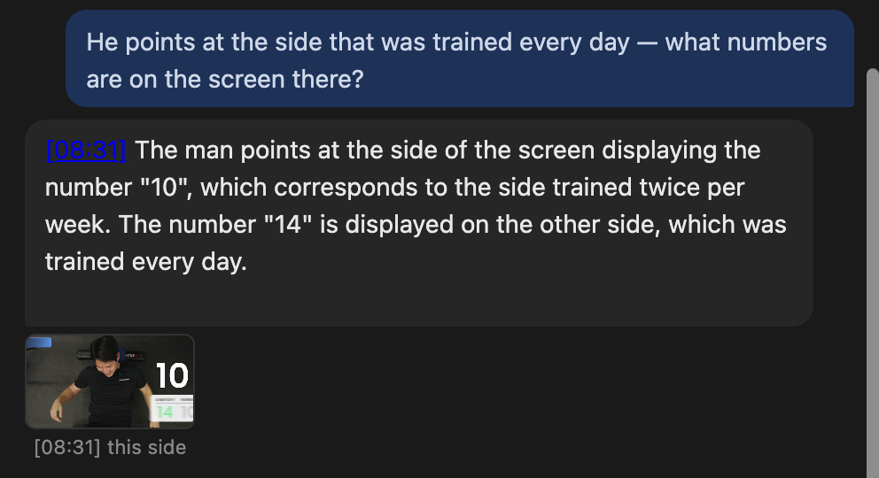

<p align="center">
  
</p>

<p align="center">
  <strong>Local-first summaries, transcripts and Q&amp;A for web pages, PDFs, YouTube —
  and any audio or video your browser can see.</strong><br/>
  Clickable timecodes. Persistent library. Open source. Local by default —
  bring your own cloud model if you want one.
</p>

<p align="center">
  <a href="LICENSE"></a>
  
  
  <a href="CLAUDE.md"></a>
</p>

---

TLDR is a Chrome side-panel extension plus a small FastAPI daemon. Click the
toolbar button on any page, PDF, YouTube video or podcast embed and you get a
streaming summary with clickable `[MM:SS]` timecodes, plus a chat box to ask
follow-up questions about the same material. Everything you process lands in
a local library (SQLite on your disk) you can come back to any time. The
daemon talks to an LLM/Whisper backend over the **OpenAI-compatible HTTP
API** — pick whatever runner you like.

<table>
  <tr>
    <td></td>
    <td></td>
    <td></td>
  </tr>
  <tr align="center">
    <td>YouTube video</td>
    <td>PDF paper</td>
    <td>Podcast audio (local Whisper)</td>
  </tr>
</table>

<p align="center">
  
  <br />
  <em>Asked about something the speaker points at, TLDR fetches that moment's frames
  and answers from the picture — the thumbnail is the frame it actually read.
  Neither number appears anywhere in the transcript.</em>
</p>

<p align="center">
  
</p>

<!-- TODO: 30-second demo GIF here (toolbar click → streaming summary →
     timecode click seeks the video → Q&A). See distribution-plan.md §4. -->

## Why TLDR, not yet another summarizer?

Browsers are growing built-in page summaries, and cloud summarizer extensions
are a dime a dozen. TLDR aims at what those don't do:

- **Any audio or video, not just pages.** If yt-dlp can extract it — a
  YouTube video, a podcast embed, a raw `<video>` tag — TLDR gets a
  transcript (official captions → auto-captions → local Whisper) and
  summarises it.
- **Clickable `[MM:SS]` timecodes** in the summary, in Q&A answers and in
  the full transcript. Click one and the player seeks right there.
- **A persistent local library.** Summaries, transcripts, translations and
  per-item chat history live in SQLite on your machine, survive restarts
  and never expire unless you say so.
- **Your model, your context window.** Any OpenAI-compatible backend —
  a local 128K-context model or a cloud model with a much bigger window —
  a two-hour podcast summarised in one pass, not snippets fed to a tiny
  built-in model.
- **Transcripts are first-class.** Read the full text, translate it into
  your language on demand, navigate by timecode.

If all you need is "shorten this article", built-in browser AI is fine. TLDR
is for *"I have 40 tabs, three lectures and a podcast backlog — condense all
of it, keep it, and keep it private."*

## Features

- **Side panel that follows the active tab.** Switch tabs and you see the
  cached summary (or "no summary yet"). Click a `[MM:SS]` timecode and the
  panel doesn't reset — same canonical URL.
- **Streaming everywhere.** Watch tokens appear live for both the summary and
  the Q&A.
- **Two paths for YouTube transcripts.** First the official transcript API,
  then yt-dlp's auto-captions, then Whisper as a last resort. Timecodes
  preserved on the first two paths.
- **Beyond YouTube: any media on the page.** Native `<video>`/`<audio>` tags
  and whitelisted embeds are detected and transcribed through the same chain;
  if several candidates are found you pick which one to process.
- **Transcript tab with translation.** The full transcript lives next to the
  summary, translated on demand into any language, navigable by timecode.
- **PDFs work too.** http(s) or local `file://` PDFs are parsed in the
  side panel via pdf.js and summarised like any other page. Image-only
  scans fall back to per-page vision OCR automatically — no separate OCR
  step needed.
- **Persistent chat per job.** Q&A history is stored in SQLite, survives tab
  switches and browser restarts.
- **Q&A can look at the video, not just the transcript.** When a video's
  transcript has the speaker actually pointing at something on screen
  ("watch this", "вот так", "hier seht ihr") and your question is about
  that moment, TLDR fetches a handful of frames from just that few-second
  span — never the whole video — and asks the model what's really there
  before answering. A frame that turned out relevant shows up as a
  thumbnail under the answer, clickable like a `[MM:SS]` timecode. It's
  honest about its limits: reading a label or judging a gesture depends on
  how legible the moment is and which vision model you're running.
- **Pause/resume all background ML** when you need the machine for foreground
  work. The in-flight step finishes; the next step parks at a checkpoint
  until you click Resume. Q&A stays responsive throughout.
- **Auto retry of failed jobs** — keeps the cached audio file so the slow
  yt-dlp step is skipped on retry.
- **Move a library between machines.** Tick any number of finished jobs in
  the Library page and export them as one zip: summaries, transcripts with
  their timings, cached translations, chat history, and the video frames
  answers were read from. Import it elsewhere and they come back as ordinary
  jobs; anything already there is skipped rather than duplicated. Reading a
  bundle needs no model at all, so a machine that can't run one — or
  shouldn't pay a cloud one — still gets the summary and the transcript, and
  only new questions need a backend.
- **No build step for the extension.** Vanilla JS + ES modules. Edit a file,
  click the reload icon.

## Quick start

TLDR needs two OpenAI-compatible endpoints: one for the LLM (`llm.base_url`)
and one for Whisper transcription (`whisper.base_url`). They can be the same
server or different ones — configure them independently in `config/tldr.yaml`.

### LLM backend (required)

Any OpenAI-compatible server works — local or cloud. Local is the default
and the point of the project; here are the popular local choices first,
cloud backends further down.

| Backend | Platform | LLM | Whisper | Notes |
|---|---|---|---|---|
| [**Ollama**](https://ollama.com/) | Any OS, CPU / GPU | ✅ | ❌ | [Download](https://ollama.com/download), then `ollama pull qwen3-vl:8b` |
| [**LM Studio**](https://lmstudio.ai/) | macOS / Windows | ✅ | ❌ | GUI; enable local server on port 1234 |
| [**mlx-openai-server**](https://pypi.org/project/mlx-openai-server/) | macOS Apple Silicon | ✅ | ✅ | Fastest local; `task install:mlx` |
| [**llama-server**](https://github.com/ggml-org/llama.cpp) | Any OS | ✅ | ❌ | `brew install llama.cpp` |
| vLLM, openai-edge, … | Any OS | ✅ | ❌ | Any OpenAI-compat endpoint |

The bundled default is **Qwen3-VL 8B** (4-bit), running with a **65536**-token
context window. That's not Qwen3-VL's real limit — it's a deliberate cap:
on a Mac's unified memory, a KV cache sized for a much larger window doesn't
fit comfortably next to the model weights, so 65536 is the window we ship.
Qwen3-VL is also the model this project measured the video-picture QA step
against (fetching a frame from a video and asking the LLM about it).

> **Context window — expand it or long pages get silently truncated.**
> Ollama and LM Studio both default to a much smaller window than 65536.
>
> **Ollama** — create a custom variant with the full context:
> ```bash
> printf 'FROM qwen3-vl:8b\nPARAMETER num_ctx 65536\n' > Modelfile
> ollama create qwen3-vl:8b-64k -f Modelfile
> ```
> Then set `model: qwen3-vl:8b-64k` and `context_length: 65536` in `config/tldr.yaml`.
>
> **LM Studio** — after loading the model, open its settings and set **Context Length** to `65536`.

<details>
<summary><strong>Prefer Gemma 4 E4B instead?</strong> (fully supported, 128K context)</summary>

Gemma 4 E4B remains a supported alternative — swap it in if you want the
larger 128K context window instead of the 65536 default, or if your machine
doesn't have enough unified memory for Qwen3-VL 8B (see the Requirements
section below). It's a thinking model, so also set `reasoning_effort` — see
`config/tldr.yaml`'s commented-out Gemma 4 block for a copy-paste config.

```bash
ollama pull gemma4:e4b
printf 'FROM gemma4:e4b\nPARAMETER num_ctx 131072\n' > Modelfile
ollama create gemma4:e4b-128k -f Modelfile
```

Then set `model: gemma4:e4b-128k` and `context_length: 131072` in
`config/tldr.yaml`, plus `reasoning_effort: "low"` (mlx/LM Studio) or
`"none"` (llama.cpp/LocalAI) to keep its thinking hidden. Video-picture QA
answers will be weaker with Gemma — it wasn't the model this feature was
measured on.

</details>

<details>
<summary><strong>Low-memory machine?</strong> Gemma 4 E2B — measured, with caveats</summary>

E2B is the smallest model this project has measured end to end, and
`scripts/smart-install.sh` already picks it when unified memory is tight.
Numbers from one 4-minute, 139-line English video on Apple Silicon against
a llama.cpp/LocalAI backend, with `reasoning_effort: "none"`:

| | Gemma 4 E4B | Gemma 4 E2B | Qwen3 1.7B |
|---|---|---|---|
| Summary (into Russian) | 16 s, accurate | 10 s, slightly shallower | 8 s, English headings, grammar slips |
| Transcript translation en→ru | 245 s, 139/139 lines | 132 s, 101/139 — the rest flagged `partial` | 91 s, 29/139 — unusable |

So **E2B is fine for summaries and Q&A, and partial for transcript
translation**: about a quarter of the lines come back in the source
language, honestly marked rather than silently passed off as translated.
Below E2B translation stops working altogether.

Disk: ~3.1 GB for E2B weights plus ~0.9 GB for the vision projector if you
want video-picture Q&A (E4B: ~4.8 GB + ~0.9 GB).

**`reasoning_effort` matters more than model size here.** Left unset on a
llama.cpp/LocalAI backend, Gemma 4 spends its output budget thinking and
the translation collapses — the same E4B run scored 139/139 lines with
`"none"` and 25/139 with the field unset. Set it.

One video, one language pair, one machine — treat these as an order of
magnitude, not a benchmark.

</details>

### Cloud backends (optional)

Local is the default and needs no API key at all. If you'd rather point
TLDR at a hosted model, any OpenAI-compatible endpoint works — same
daemon, same pipeline, no code changes. Ready-made config blocks for the
usual providers are in `config/tldr.yaml.example`, and the settings page
in the extension can set all of this without touching YAML.

<details>
<summary><strong>Provider URLs, where to get a key, key storage, and cost</strong></summary>

Where to get the URL and the key (checked 2026-07-31 — providers do move
these, so treat the links as the starting point, not gospel):

| Provider | `llm.base_url` | Get a key at | Key looks like |
|---|---|---|---|
| OpenAI | `https://api.openai.com/v1` | [platform.openai.com/api-keys](https://platform.openai.com/api-keys) | `sk-…` |
| Anthropic | `https://api.anthropic.com/v1/` | [platform.claude.com/settings/keys](https://platform.claude.com/settings/keys) | `sk-ant-api03-…` |
| Google Gemini | `https://generativelanguage.googleapis.com/v1beta/openai/` | [aistudio.google.com/apikey](https://aistudio.google.com/apikey) | — |
| OpenRouter | `https://openrouter.ai/api/v1` | [openrouter.ai/keys](https://openrouter.ai/keys) | `sk-or-v1-…` |
| Groq | `https://api.groq.com/openai/v1` | [console.groq.com/keys](https://console.groq.com/keys) | `gsk_…` |
| DeepSeek | `https://api.deepseek.com` | [platform.deepseek.com/api_keys](https://platform.deepseek.com/api_keys) | — |
| Mistral | `https://api.mistral.ai/v1` | [console.mistral.ai](https://console.mistral.ai) | — |
| Together AI | `https://api.together.ai/v1` | [api.together.ai settings → API keys](https://api.together.ai/settings/projects/~current/api-keys) | — |
| Fireworks AI | `https://api.fireworks.ai/inference/v1` | [app.fireworks.ai → API keys](https://app.fireworks.ai/settings/users/api-keys) | — |
| xAI (Grok) | `https://api.x.ai/v1` | [console.x.ai → API keys](https://console.x.ai/team/default/api-keys) | — |

The trailing slash on the Gemini URL is **not** optional. `—` means the
provider doesn't document a fixed key prefix; don't treat a differently
shaped key as wrong.

Two provider quirks worth knowing before you debug something that looks
like our bug:

- **Anthropic's compatibility layer** doesn't document `GET /models`, which
  is what `/health` probes — the daemon may report the backend as
  unreachable while summaries work fine. It also ignores `reasoning_effort`.
- **Gemini's compatibility layer** documents `tool_choice` only as `auto`.
  Q&A's planning step forces one specific tool, so if that isn't honoured
  the plan step falls back to searching the web (which is the safe
  direction, but it means more searches than strictly needed).

**Azure OpenAI** needs the newer v1 endpoint —
`https://{resource}.openai.azure.com/openai/v1/` — because the classic
`/openai/deployments/{deployment}/…?api-version=…` shape doesn't fit
`base_url` + `model` + a bearer token. With the v1 path, `model` is the
*deployment* name.

**OpenAI**
```yaml
llm:
  base_url: https://api.openai.com/v1
  api_key_file: ~/.config/tldr/openai.key   # see "API key storage" below
  model: gpt-5                              # or gpt-5-mini, o4-mini, ...
  context_length: 400000                    # check your model's window — not the local default's 65536
  single_pass_token_limit: 240000           # ~60% of context_length
  max_concurrent_calls: 3                   # hosted backends tolerate more parallelism than a laptop GPU
```

**Anthropic** (via its [OpenAI-compatible endpoint](https://docs.anthropic.com/en/api/openai-sdk))
```yaml
llm:
  base_url: https://api.anthropic.com/v1
  api_key_file: ~/.config/tldr/anthropic.key
  model: claude-sonnet-4-5
  context_length: 200000
  single_pass_token_limit: 120000
  max_concurrent_calls: 3
```

**Google Gemini** (via its [OpenAI-compatible endpoint](https://ai.google.dev/gemini-api/docs/openai))
```yaml
llm:
  base_url: https://generativelanguage.googleapis.com/v1beta/openai/
  api_key_file: ~/.config/tldr/gemini.key
  model: gemini-2.5-flash
  context_length: 1000000
  single_pass_token_limit: 600000
  max_concurrent_calls: 3
```

**OpenRouter** (one key, routes to almost any hosted model)
```yaml
llm:
  base_url: https://openrouter.ai/api/v1
  api_key_file: ~/.config/tldr/openrouter.key
  model: openai/gpt-5                       # provider/model — pick anything OpenRouter hosts
  context_length: 400000                    # match whichever model you route to
  single_pass_token_limit: 240000
  max_concurrent_calls: 3
```

Whichever provider you pick, set `context_length` / `single_pass_token_limit`
to *that model's* window, not the 65536 figure the local default block
uses — otherwise you're leaving most of a paid context window unused (or,
the other way, tripping the backend's real limit).

Reasoning models (GPT-5/o-series, and "thinking" models generally) spend
part of their output budget on hidden reasoning before the visible answer
starts. `reasoning_headroom_tokens` (default `4000`) reserves room for that
so the answer doesn't get cut off partway. `token_param` (default `auto`)
and `send_temperature` are escape hatches for when the daemon's automatic
backend-dialect detection guesses wrong — normally you don't need to set
them; `auto` probes the backend's dialect from its first response (and
retries once on an HTTP 400), so GPT-5/o-series work out of the box.

#### API key storage

TLDR is single-user and needs a human at the browser regardless (the Chrome
extension is how you use it at all), so a headless daemon — no logged-in
user at the console — isn't a supported scenario. That makes the OS
keychain the natural default: it's already there whenever the daemon runs.

This applies **independently** to `llm.*` and `whisper.*` — either section
can point at a cloud backend and store its own key with its own choice of
mechanism (e.g. LLM via keychain, Whisper inline, or any other combination).
The two never share storage: separate keychain service
(`tldr-daemon-llm` / `tldr-daemon-whisper`), separate key file (`llm.key` /
`whisper.key`), separate env var.

Four ways to give the daemon a key, in priority order (first match wins):

1. **`TLDR__LLM__API_KEY` / `TLDR__WHISPER__API_KEY` environment
   variable** — overrides everything below, for that section only.
   Convenient for Docker/foreground runs and CI, or when the key already
   lives in your service's environment.
2. **OS keychain** (recommended, and the default the options page and
   `PATCH /config` pick when available) — `api_key_keychain` (service name)
   + `api_key_keychain_account` (account name), backed by macOS Keychain or
   the Linux Secret Service. `keyring` is a base dependency — no extra
   install step needed. The daemon writes the entry itself (via the
   options page or `PATCH /config`), and the creator of a Keychain item is
   automatically added to its own trusted-app ACL, so the same daemon
   binary reads it back later with zero prompts — including after
   `uv tool install --force` (the venv is rebuilt, but the `keyring` code
   and the underlying macOS binary it talks to don't change). The key is
   resolved once per process start, not per request. To set it by hand:
   ```bash
   security add-generic-password -s tldr-daemon-llm -a openai -w '<your-api-key>'      # macOS, LLM
   security add-generic-password -s tldr-daemon-whisper -a openai -w '<your-api-key>'  # macOS, Whisper
   ```
   — then reference it:
   ```yaml
   llm:
     api_key_keychain: tldr-daemon-llm
     api_key_keychain_account: openai
   whisper:
     api_key_keychain: tldr-daemon-whisper
     api_key_keychain_account: openai
   ```
   On Linux this needs a working Secret Service (GNOME Keyring / KWallet)
   running in your session — `GET /config`'s `keychain_available` reports
   whether one was found, and the options page falls back to File
   automatically when it wasn't.
3. **`api_key_file`** — a path (`~` expands) to a file holding just the
   key, locked to `0600`. This is the right choice for Docker installs
   (no macOS Keychain, no Secret Service inside the container) and for
   anyone who just prefers a file:
   ```bash
   install -m 600 /dev/null ~/.config/tldr/openai.key
   printf '%s' 'sk-...' > ~/.config/tldr/openai.key
   ```
   (or `umask 077` before creating the file by hand.) Point both
   `llm.api_key_file` and `whisper.api_key_file` at the same file if
   they share one provider key, or use two separate files.
4. **`api_key`** inline in `tldr.yaml` — fine for local backends that ignore
   the value (`ollama`, `dummy`, `lm-studio`, …). Avoid it for real cloud
   keys: `tldr.yaml` is created `0600`, but a plaintext key in a config file
   you might `cat`, screen-share, or back up is still a plaintext key.

For systemd (native Linux install), an alternative to all of the above is an
`EnvironmentFile` on the `tldr-daemon` unit setting `TLDR__LLM__API_KEY` /
`TLDR__WHISPER__API_KEY`, kept outside the repo with its own restrictive
permissions.

#### Privacy and cost, with a cloud backend

Point `llm.base_url` at a cloud provider and the page text or transcript
you process leaves your machine and goes to that provider — same as pasting
it into their chat UI. The "nothing leaves your machine" story only holds
for a local backend; going cloud is an explicit trade you're opting into.
Cloud inference is billed by the provider per token, and cloud Whisper
transcription (e.g. OpenAI's `whisper-1`) is billed per minute — both are
the provider's cost, not TLDR's.

**Pick a multimodal model that also does tool calling.** TLDR sends images
to the LLM (vision OCR for scanned PDFs, video frames for Q&A) and forces a
specific tool call in Q&A's planning step, so a text-only model can't run
the whole pipeline. On OpenRouter, 182 of 340 models accepted image input
when this was checked (2026-08-06) — but note that some vendors have none
at all there, DeepSeek among them.

The numbers below are for one hour of video: summarise it, translate the
whole transcript into another language, and look at three moments of the
picture. An hour of speech is roughly 13K tokens of transcript, and a frame
at 768×432 costs about 440 image tokens. Transcription is billed separately
(below) and is not in these figures. Every model listed was released in
2026, takes image input, and does tool calling; prices are from
OpenRouter's model list on 2026-08-06.

| Model | One hour |
|---|---|
| `qwen/qwen3.7-flash` | $0.004 |
| `google/gemma-4-26b-a4b-it` | $0.010 |
| `xiaomi/mimo-v2.5` | $0.011 |
| `openai/gpt-5.6-luna` | $0.017 |
| `google/gemini-3.5-flash-lite` | $0.066 |
| `x-ai/grok-4.5` | $0.205 |
| `anthropic/claude-sonnet-5` | $0.294 |

85 models on OpenRouter clear that bar, so this is a sample, not a
shortlist. Two things to watch when you substitute your own: an older
generation from the same vendor is often *cheaper* than its current one
(Gemini 3.1 Flash-Lite runs the same hour for $0.042), so sort by date as
well as price; and a headline price means nothing if the context window
can't hold the job — an hour of transcript plus its translation needs well
over 16K tokens, which rules out several of the cheapest models on offer.
Sonnet 5 is priced here at its introductory rate; at list price the hour is
$0.441.

Transcription is separate and billed per minute of audio, not per token:
about $0.04 an hour on Groq's `whisper-large-v3-turbo`, about $0.36 an hour
on OpenAI's `whisper-1`. Both speak the same OpenAI-compatible
`/audio/transcriptions` endpoint, so either drops straight into
`whisper.base_url`.

Two things that table is worth reading for. **Translating the transcript
dominates** — it emits as many tokens as it reads, and output costs several
times more than input everywhere, so on the pricier rows it is most of the
bill; `llm` and the transcript translator can point at different models if
you want to split that. And **looking at the video is the cheapest thing
TLDR does** — those three moments are under a tenth of a cent on the cheap
rows and about two and a half cents on the dearest one. Whatever a cloud
backend costs you, it isn't the frames.

</details>

### Whisper backend (optional — only for YouTube without captions)

Required only when `youtube-transcript-api` and yt-dlp captions both fail.
If you skip it, those videos will error instead of transcribing via Whisper.

| Backend | Platform | Notes |
|---|---|---|
| **mlx-openai-server** | macOS Apple Silicon | Already included if you use it for LLM |
| [**faster-whisper-server**](https://github.com/fedirz/faster-whisper-server) | Any OS, CPU / GPU | `docker run -p 8000:8000 fedirz/faster-whisper-server` |
| [**whisper.cpp server**](https://github.com/ggml-org/whisper.cpp) | Any OS | `brew install whisper-cpp`; start with `whisper-server` |
| **Cloud** | — | See the short list below — *most* LLM providers have no transcription API at all |

Like the LLM backend, `whisper.base_url` can point at a cloud provider —
`whisper.api_key` supports the exact same three storage mechanisms
(environment variable, OS keychain, file) as `llm.api_key`, fully
independent of it; see [API key storage](#api-key-storage).

<details>
<summary><strong>Cloud transcription — who actually offers it</strong> (most LLM providers have no audio API at all)</summary>

This is the part that trips people up: a provider selling you a great chat
model very often has **no audio endpoint whatsoever**. We need
`POST {base_url}/audio/transcriptions` to accept a multipart `file` and
return `verbose_json` **with segments** — without segments the transcript
has no timecodes, so clicking a `[MM:SS]` in the summary can't seek
anywhere. Checked 2026-07-31:

| Provider | `whisper.base_url` | `whisper.model` | Notes |
|---|---|---|---|
| **OpenAI** | `https://api.openai.com/v1` | `whisper-1` | Use `whisper-1`. The newer `gpt-4o-transcribe` / `gpt-4o-mini-transcribe` document only `json` — **timecodes silently disappear** |
| **Groq** | `https://api.groq.com/openai/v1` | `whisper-large-v3-turbo` or `whisper-large-v3` | Segment and word granularities both supported; cheap and fast |
| **Together AI** | `https://api.together.ai/v1` | `openai/whisper-large-v3` | `verbose_json` returns segments with start/end |
| **OpenRouter** | `https://openrouter.ai/api/v1` | e.g. `openai/whisper-large-v3` | Works only while it routes to one of the three above — its docs say other providers reject `verbose_json` with a 400 |

**No transcription endpoint** (fine for `llm.*`, unusable for `whisper.*`):
Anthropic, Google Gemini, DeepSeek. Two special cases: **Fireworks AI**
deprecated audio inference in June 2026, and **xAI** does have speech-to-text
but at `/v1/stt`, not the OpenAI-compatible path, so our client can't reach
it.

Unverified, so try before you rely on it: **Mistral** exposes
`/v1/audio/transcriptions` (`voxtral-mini-latest`) but doesn't document
`response_format`, so our `verbose_json` request may be rejected or ignored;
**Azure OpenAI** documents transcription only for its dated API versions, so
whether it works through the v1 path above is untested here.

Cloud transcription is billed per minute of audio, and a long podcast is a
lot of minutes — local Whisper stays free.

</details>

### Install — native, no Docker (recommended)

One command; works on macOS and Linux (Windows is experimental):

```bash
curl -fsSL https://raw.githubusercontent.com/melnikaite/tldr-free/main/scripts/install-uv.sh | sh
# or from a checkout: task install:uv
```

The script installs [uv](https://docs.astral.sh/uv/) if missing, installs the
daemon as a uv tool, creates the config from the packaged template, registers
a user-level autostart service (launchd LaunchAgent on macOS, systemd user
unit on Linux) and waits for `/health`.

Lifecycle after that:

```bash
tldr-daemon service status      # unit present? /health ok?
tldr-daemon service uninstall   # stop + remove autostart
tldr-daemon service install     # register + start again (= restart)
tldr-daemon                     # or run in the foreground, no service
task uninstall:uv               # remove everything (keeps your data)
```

Config and data live in the platform-conventional dirs —
`~/Library/Application Support/tldr/` on macOS,
`$XDG_CONFIG_HOME/tldr` + `$XDG_DATA_HOME/tldr` on Linux. Edit
`tldr.yaml` there (backend URLs point at `127.0.0.1`, and it's created
`0600`), then restart the service. Switching `llm.base_url` to a cloud
provider works the same way here as in Docker — see
[Cloud backends](#cloud-backends-optional) and
[API key storage](#api-key-storage); on Linux, an `EnvironmentFile` on the
`tldr-daemon` systemd unit is a good place for `TLDR__LLM__API_KEY` instead
of putting the key in `tldr.yaml` at all.

To **update**: `uv tool install --force git+https://github.com/melnikaite/tldr-free#subdirectory=daemon`
(or `--force ./daemon` from a checkout), then restart the service. yt-dlp and
youtube-transcript-api self-update on every daemon start, so YouTube breakage
usually fixes itself with a restart.

`ffmpeg` on PATH is needed for the Whisper fallback
(`brew install ffmpeg` / `apt install ffmpeg`).

### Install — Docker

```bash
task install            # config + daemon image + extension vendor libs
# Edit config/tldr.yaml — set llm.base_url (and whisper.base_url if needed)
# Ready-made blocks for Ollama, LM Studio, mlx, llama-server, and cloud
# providers (OpenAI, Anthropic, Gemini, OpenRouter) are in the file
task up                 # starts daemon (and mlx-server if you ran task install:mlx)
task status             # health check
```

If you use `task install:mlx`, the live mlx-server config lives at
`~/.mlx-server/config.yaml` — outside this repo so you can share it with
other tools. Edit that file, `task down && task up`, done.

Load the extension once:

1. Open `chrome://extensions`, enable Developer mode.
2. Click "Load unpacked", select the `extension/` directory.
3. After source changes, hit the reload icon — no rebuild step.

## Daily commands

Native mode: `tldr-daemon service status|install|uninstall` (see above).
Docker mode:

```
task up          # start
task down        # stop (sqlite volume preserved)
task status      # health check
task logs        # tail daemon logs (mlx logs are in ~/.mlx-server/logs/server.{out,err}.log)
task reset       # destructive: wipes the database volume (asks for confirmation)
task test        # ruff + mypy + pytest inside the daemon container
```

## Configuration

`config/tldr.yaml` (created from `tldr.yaml.example` on `task install`, or
from the packaged template on first native run — see below) holds the
backend URLs, API keys, output language, retry behaviour, retention window,
and concurrency caps. It's created with `0600` permissions so only your user
account can read it.

`llm.base_url` and `whisper.base_url` are **independent** — point them at the
same server or different ones:

```yaml
# Example: LM Studio for LLM, mlx-server for Whisper
llm:
  base_url: http://host.docker.internal:1234/v1    # LM Studio
  model: qwen/qwen3-vl-8b                          # model ID shown by LM Studio
  context_length: 65536                            # must match what the backend loaded
  single_pass_token_limit: 40000                   # ~60% of context_length
  max_concurrent_calls: 1

whisper:
  base_url: http://host.docker.internal:18000/v1   # mlx-openai-server
  model: whisper

output:
  language: en                                     # ISO 639-1 or full name

youtube:
  subtitle_lang_preferences: ["en", "ru"]

storage:
  retention_days: 365                              # 0 disables auto-cleanup
```

Retention counts from the day a job was **added to this machine**, not the
day the material was processed — so importing a bundle of year-old videos
doesn't hand them straight to the next sweep. It's also editable from the
extension's options page, along with an off switch, so this one doesn't
need hand-editing.

**`context_length` must match what the backend actually loaded** — a mismatch
causes "n_keep >= n_ctx" errors. Check with `lms ps` (LM Studio) or look at
the `context_length` field in `~/.mlx-server/config.yaml` (mlx-server).
`single_pass_token_limit` caps the input before map-reduce kicks in; keep it
at ~60–70% of `context_length` to leave room for the system prompt and output.

**Editing settings from the extension** (backend/model/API key/output
language, for both LLM and Whisper) is also possible without touching YAML
by hand: open it via `chrome://extensions` → TLDR → Details → Extension
options (or right-click the toolbar icon → Options). Each backend section
has its own **Test connection** button, answering "is my key even valid?"
for that section — it calls `POST /config/test` below with
`target: "llm"` or `target: "whisper"` (`target` defaults to `"llm"` when
omitted, so older callers keep working unchanged). The daemon exposes
`GET /config`, `PATCH /config`, and `POST /config/test` (probes credentials
without saving — LLM gets reachability + a minimal completion; Whisper
gets reachability only, since a real transcription probe would need an
audio file). Partial `PATCH` writes land in `tldr.local.yaml`, a second
file created next to `tldr.yaml` and deep-merged on top of it at load time
(env var overrides still win over both); `tldr.yaml` itself is never
rewritten, so its comments and backend examples stay intact. Both files
are `0600`. `GET`/`PATCH` responses never include either API key itself —
only, per section, `api_key_set` (bool), `api_key_hint` (last 4 chars),
`api_key_source` (`env` / `keychain` / `file` / `inline` / `none`), plus a
top-level `keychain_available` (bool — whether a real, usable keychain
backend was found, shared by both sections). Picking `api_key_storage:
keychain` (the default when `keychain_available` is true) or `file` (the
default otherwise, and always the right choice for Docker) via `PATCH`
keeps the key out of both YAML files entirely — independently for `llm`
and `whisper`, each with its own keychain entry and key file, so patching
one never touches the other's storage. After writing a key, `PATCH` reads
it straight back through the same code path the daemon uses at call time
and reports `api_key_verified` (bool) + `api_key_verify_error` (string or
null) for `llm`, and `whisper_api_key_verified` /
`whisper_api_key_verify_error` for `whisper` — a failed verification is
reported, not rolled back, so you find out immediately instead of on the
next LLM/Whisper call. Changing `llm.max_concurrent_calls` needs a daemon
restart to take effect — the response's `restart_required` flag says so.

`tldr.yaml.example` has ready-made blocks for each backend combination:
mlx-openai-server (LLM+Whisper), LM Studio+mlx, Ollama, llama-server+whisper.cpp,
LLM-only (no Whisper), and the cloud providers from
[Cloud backends](#cloud-backends-optional) above. For a cloud `llm.base_url`,
set `context_length` / `single_pass_token_limit` to that model's context
window, not the 65536 figure the local default examples use, and prefer
`api_key_file` (or the keychain fields) over inline `api_key` — see
[API key storage](#api-key-storage).

To free the machine for foreground work, click the **Pause processing**
button in the Library page (top-right). It pauses everything: the Whisper
queue stops picking up new transcriptions, and any new page/YouTube job
parks before the LLM call. In-flight work finishes; QA stays unblocked.
The same gate from the API:

```bash
curl -X POST http://localhost:8765/workers/pause
curl -X POST http://localhost:8765/workers/resume
curl       http://localhost:8765/workers           # status
```

State is in-memory and resets on daemon restart. To space jobs out without
fully pausing, set `workers.cooldown_seconds` in `config/tldr.yaml` — the
worker waits that many seconds between consecutive jobs.

## Architecture

```
┌─ Host ────────────────────────────────────────────────────────┐
│                                                               │
│  Any OpenAI-compatible LLM/Whisper backend                    │
│  (Ollama / LM Studio / mlx-openai-server / vLLM / ...)        │
│                                                               │
│  ┌─ Docker: daemon (port 8765) ─────────────────────────────┐ │
│  │  FastAPI                                                 │ │
│  │  Async POST /jobs → background pipeline                  │ │
│  │  Per-job event broker fans out stage / delta / done      │ │
│  │  /ai/stream — single SSE endpoint for summary + Q&A      │ │
│  │  Whisper queue with pause/resume                         │ │
│  │  Retry endpoint reuses cached audio                      │ │
│  │  yt-dlp + auto-captions + Whisper fallback chain         │ │
│  │  SQLite in named volume `tldr-data`                      │ │
│  └──────────────────────────────────────────────────────────┘ │
└───────────────────────────────────────────────────────────────┘
                            ▲
                            │ http://localhost:8765
                            │
        ┌─ Chrome extension (MV3, vanilla JS) ─────┐
        │  Side panel follows the active tab        │
        │  Live timeline + streaming markdown       │
        │  Library page with retry / delete / pause │
        └───────────────────────────────────────────┘
```

More detail in [`.claude/architecture.md`](.claude/architecture.md), plus
topic-specific docs under [`.claude/`](.claude/) — see
[`CLAUDE.md`](CLAUDE.md) for the full map.

## Repository layout

```
.
├── README.md
├── CLAUDE.md                     # orientation for code agents (links to .claude/*.md)
├── .claude/                      # topic-named contributor docs (see CLAUDE.md for the map)
├── Taskfile.yml                  # all dev commands
├── docker-compose.yml
├── scripts/
│   ├── install.sh                # core install (config + daemon image + vendor libs)
│   └── mlx.sh                    # optional Apple Silicon backend: install + start/stop/status
├── config/
│   ├── mlx-server.yaml.example   # template; on `task install:mlx` copied to ~/.mlx-server/config.yaml
│   └── tldr.yaml.example         # template; on `task install` copied to config/tldr.yaml
├── docs/
│   └── logo-banner.svg
├── daemon/                       # FastAPI service in Docker
│   ├── Dockerfile
│   ├── pyproject.toml
│   └── src/
└── extension/                    # Chrome MV3 extension (vanilla JS, no build)
    ├── manifest.json
    ├── public/icons/             # icon.svg → icon{16,48,128}.png
    ├── src/
    └── vendor/                   # marked, DOMPurify, Readability (downloaded by installer)
```

## Requirements

- **Daemon**: Docker (OrbStack or Docker Desktop). Anything with Python
  works — the container is `python:3.11-slim`. No host Python needed.
- **A backend**: see Quick start. Anything OpenAI-compatible works.
- **Chrome 116+** (Manifest V3 side panel).
- **Apple Silicon, optional**: only if you want the bundled mlx setup (`task install:mlx`).
  ~7-8 GB disk for Qwen3-VL 8B (4-bit) + Whisper large-v3 weights. On
  machines with less unified memory, `scripts/smart-install.sh` installs
  the smaller Gemma 4 E2B (4-bit) instead — see the LLM backend table
  above.

## Roadmap

Near-term, roughly in order:

- [ ] Chrome Web Store listing (signed, auto-updating install)
- [ ] Daemon install without Docker (`pipx install` / single binary)
- [ ] Zero-config pairing with an already-running Ollama
- [ ] Full-text search across the library
- [ ] Firefox port
- [ ] Export to Markdown / Obsidian

Opinions and PRs welcome — open an issue.

## Contributing

The codebase ships orientation docs for humans and AI agents alike: start at
[CLAUDE.md](CLAUDE.md), which maps the topic docs in [.claude/](.claude/) —
architecture, event model, worker invariants, dev runbook. `task test` runs
ruff + mypy + pytest in the daemon container; the extension has no build
step at all.

## License

MIT.
