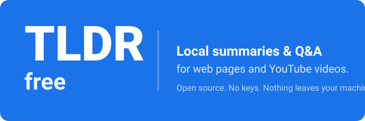
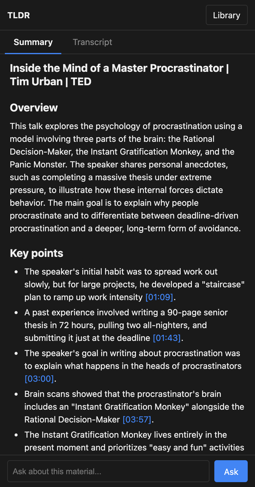
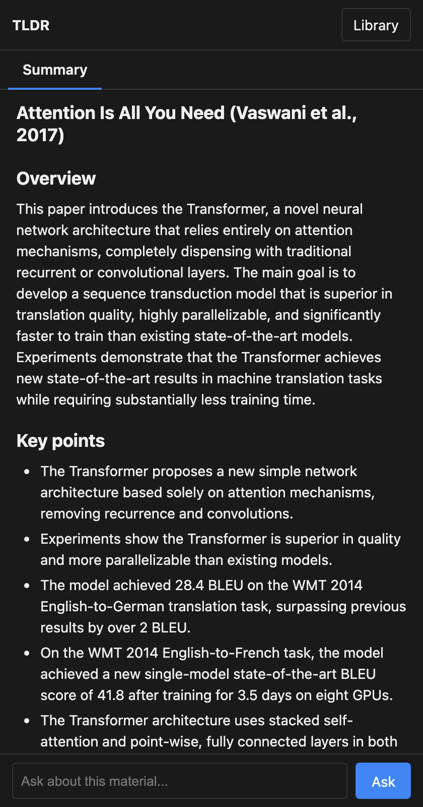
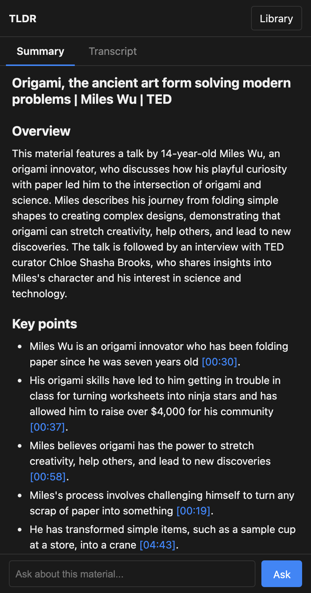
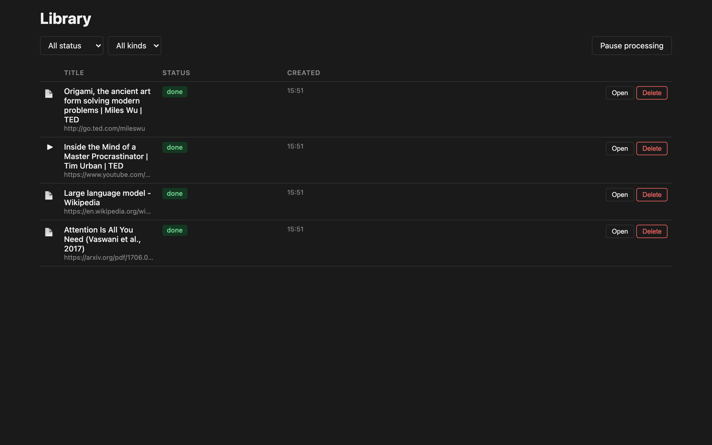

<p align="center">
  
</p>

<p align="center">
  <strong>Local summaries, transcripts and Q&amp;A for web pages, PDFs, YouTube —
  and any audio or video your browser can see.</strong><br/>
  Clickable timecodes. Persistent library. Open source. No API keys.
  Nothing leaves your machine.
</p>

<p align="center">
  <a href="LICENSE"></a>
  
  
  <a href="CLAUDE.md"></a>
</p>

---

TLDR is a Chrome side-panel extension plus a small FastAPI daemon. Click the
toolbar button on any page, PDF, YouTube video or podcast embed and you get a
streaming summary with clickable `[MM:SS]` timecodes, plus a chat box to ask
follow-up questions about the same material. Everything you process lands in
a local library (SQLite on your disk) you can come back to any time. The
daemon talks to an LLM/Whisper backend over the **OpenAI-compatible HTTP
API** — pick whatever runner you like.

<table>
  <tr>
    <td></td>
    <td></td>
    <td></td>
  </tr>
  <tr align="center">
    <td>YouTube video</td>
    <td>PDF paper</td>
    <td>Podcast audio (local Whisper)</td>
  </tr>
</table>

<p align="center">
  
</p>

<!-- TODO: 30-second demo GIF here (toolbar click → streaming summary →
     timecode click seeks the video → Q&A). See distribution-plan.md §4. -->

## Why TLDR, not yet another summarizer?

Browsers are growing built-in page summaries, and cloud summarizer extensions
are a dime a dozen. TLDR aims at what those don't do:

- **Any audio or video, not just pages.** If yt-dlp can extract it — a
  YouTube video, a podcast embed, a raw `<video>` tag — TLDR gets a
  transcript (official captions → auto-captions → local Whisper) and
  summarises it.
- **Clickable `[MM:SS]` timecodes** in the summary, in Q&A answers and in
  the full transcript. Click one and the player seeks right there.
- **A persistent local library.** Summaries, transcripts, translations and
  per-item chat history live in SQLite on your machine, survive restarts
  and never expire unless you say so.
- **Your model, your context window.** Any OpenAI-compatible backend, up to
  128K context — a two-hour podcast summarised in one pass, not snippets
  fed to a tiny built-in model.
- **Transcripts are first-class.** Read the full text, translate it into
  your language on demand, navigate by timecode.

If all you need is "shorten this article", built-in browser AI is fine. TLDR
is for *"I have 40 tabs, three lectures and a podcast backlog — condense all
of it, keep it, and keep it private."*

## Features

- **Side panel that follows the active tab.** Switch tabs and you see the
  cached summary (or "no summary yet"). Click a `[MM:SS]` timecode and the
  panel doesn't reset — same canonical URL.
- **Streaming everywhere.** Watch tokens appear live for both the summary and
  the Q&A.
- **Two paths for YouTube transcripts.** First the official transcript API,
  then yt-dlp's auto-captions, then Whisper as a last resort. Timecodes
  preserved on the first two paths.
- **Beyond YouTube: any media on the page.** Native `<video>`/`<audio>` tags
  and whitelisted embeds are detected and transcribed through the same chain;
  if several candidates are found you pick which one to process.
- **Transcript tab with translation.** The full transcript lives next to the
  summary, translated on demand into any language, navigable by timecode.
- **PDFs work too.** http(s) or local `file://` PDFs are parsed in the
  side panel via pdf.js and summarised like any other page. (Image-only
  scans need OCR first — not built in.)
- **Persistent chat per job.** Q&A history is stored in SQLite, survives tab
  switches and browser restarts.
- **Pause/resume all background ML** when you need the machine for foreground
  work. The in-flight step finishes; the next step parks at a checkpoint
  until you click Resume. Q&A stays responsive throughout.
- **Auto retry of failed jobs** — keeps the cached audio file so the slow
  yt-dlp step is skipped on retry.
- **No build step for the extension.** Vanilla JS + ES modules. Edit a file,
  click the reload icon.

## Quick start

TLDR needs two OpenAI-compatible endpoints: one for the LLM (`llm.base_url`)
and one for Whisper transcription (`whisper.base_url`). They can be the same
server or different ones — configure them independently in `config/tldr.yaml`.

### LLM backend (required)

Any OpenAI-compatible server works. Popular choices:

| Backend | Platform | LLM | Whisper | Notes |
|---|---|---|---|---|
| [**Ollama**](https://ollama.com/) | Any OS, CPU / GPU | ✅ | ❌ | [Download](https://ollama.com/download), then `ollama pull gemma4:e4b` |
| [**LM Studio**](https://lmstudio.ai/) | macOS / Windows | ✅ | ❌ | GUI; enable local server on port 1234 |
| [**mlx-openai-server**](https://pypi.org/project/mlx-openai-server/) | macOS Apple Silicon | ✅ | ✅ | Fastest local; `task install:mlx` |
| [**llama-server**](https://github.com/ggml-org/llama.cpp) | Any OS | ✅ | ❌ | `brew install llama.cpp` |
| vLLM, openai-edge, … | Any OS | ✅ | ❌ | Any OpenAI-compat endpoint |

> **Context window — expand it or long pages get silently truncated.**
> Gemma 4 E4B supports 128K but both Ollama and LM Studio default to a much smaller window.
>
> **Ollama** — create a custom variant with the full context:
> ```bash
> printf 'FROM gemma4:e4b\nPARAMETER num_ctx 131072\n' > Modelfile
> ollama create gemma4:e4b-128k -f Modelfile
> ```
> Then set `model: gemma4:e4b-128k` and `context_length: 131072` in `config/tldr.yaml`.
>
> **LM Studio** — after loading the model, open its settings and set **Context Length** to `131072`.

### Whisper backend (optional — only for YouTube without captions)

Required only when `youtube-transcript-api` and yt-dlp captions both fail.
If you skip it, those videos will error instead of transcribing via Whisper.

| Backend | Platform | Notes |
|---|---|---|
| **mlx-openai-server** | macOS Apple Silicon | Already included if you use it for LLM |
| [**faster-whisper-server**](https://github.com/fedirz/faster-whisper-server) | Any OS, CPU / GPU | `docker run -p 8000:8000 fedirz/faster-whisper-server` |
| [**whisper.cpp server**](https://github.com/ggml-org/whisper.cpp) | Any OS | `brew install whisper-cpp`; start with `whisper-server` |

### Install — native, no Docker (recommended)

One command; works on macOS and Linux (Windows is experimental):

```bash
curl -fsSL https://raw.githubusercontent.com/melnikaite/tldr-free/main/scripts/install-uv.sh | sh
# or from a checkout: task install:uv
```

The script installs [uv](https://docs.astral.sh/uv/) if missing, installs the
daemon as a uv tool, creates the config from the packaged template, registers
a user-level autostart service (launchd LaunchAgent on macOS, systemd user
unit on Linux) and waits for `/health`.

Lifecycle after that:

```bash
tldr-daemon service status      # unit present? /health ok?
tldr-daemon service uninstall   # stop + remove autostart
tldr-daemon service install     # register + start again (= restart)
tldr-daemon                     # or run in the foreground, no service
task uninstall:uv               # remove everything (keeps your data)
```

Config and data live in the platform-conventional dirs —
`~/Library/Application Support/tldr/` on macOS,
`$XDG_CONFIG_HOME/tldr` + `$XDG_DATA_HOME/tldr` on Linux. Edit
`tldr.yaml` there (backend URLs point at `127.0.0.1`), then restart the
service.

To **update**: `uv tool install --force git+https://github.com/melnikaite/tldr-free#subdirectory=daemon`
(or `--force ./daemon` from a checkout), then restart the service. yt-dlp and
youtube-transcript-api self-update on every daemon start, so YouTube breakage
usually fixes itself with a restart.

`ffmpeg` on PATH is needed for the Whisper fallback
(`brew install ffmpeg` / `apt install ffmpeg`).

### Install — Docker

```bash
task install            # config + daemon image + extension vendor libs
# Edit config/tldr.yaml — set llm.base_url (and whisper.base_url if needed)
# Ready-made blocks for Ollama, LM Studio, mlx, llama-server are in the file
task up                 # starts daemon (and mlx-server if you ran task install:mlx)
task status             # health check
```

If you use `task install:mlx`, the live mlx-server config lives at
`~/.mlx-server/config.yaml` — outside this repo so you can share it with
other tools. Edit that file, `task down && task up`, done.

Load the extension once:

1. Open `chrome://extensions`, enable Developer mode.
2. Click "Load unpacked", select the `extension/` directory.
3. After source changes, hit the reload icon — no rebuild step.

## Daily commands

Native mode: `tldr-daemon service status|install|uninstall` (see above).
Docker mode:

```
task up          # start
task down        # stop (sqlite volume preserved)
task status      # health check
task logs        # tail daemon logs (mlx logs are in ~/.mlx-server/logs/server.{out,err}.log)
task reset       # destructive: wipes the database volume (asks for confirmation)
task test        # ruff + mypy + pytest inside the daemon container
```

## Configuration

`config/tldr.yaml` (created from `tldr.yaml.example` on `task install`) holds
the backend URLs, output language, retry behaviour, retention window, and
concurrency caps.

`llm.base_url` and `whisper.base_url` are **independent** — point them at the
same server or different ones:

```yaml
# Example: LM Studio for LLM, mlx-server for Whisper
llm:
  base_url: http://host.docker.internal:1234/v1    # LM Studio
  model: google/gemma-4-e4b                        # model ID shown by LM Studio
  context_length: 131072                           # must match what the backend loaded
  single_pass_token_limit: 80000                   # ~60% of context_length
  max_concurrent_calls: 1

whisper:
  base_url: http://host.docker.internal:18000/v1   # mlx-openai-server
  model: whisper

output:
  language: en                                     # ISO 639-1 or full name

youtube:
  subtitle_lang_preferences: ["en", "ru"]

storage:
  retention_days: 365                              # 0 disables auto-cleanup
```

**`context_length` must match what the backend actually loaded** — a mismatch
causes "n_keep >= n_ctx" errors. Check with `lms ps` (LM Studio) or look at
the `context_length` field in `~/.mlx-server/config.yaml` (mlx-server).
`single_pass_token_limit` caps the input before map-reduce kicks in; keep it
at ~60–70% of `context_length` to leave room for the system prompt and output.

`tldr.yaml.example` has ready-made blocks for each backend combination:
mlx-openai-server (LLM+Whisper), LM Studio+mlx, Ollama, llama-server+whisper.cpp,
and LLM-only (no Whisper).

To free the machine for foreground work, click the **Pause processing**
button in the Library page (top-right). It pauses everything: the Whisper
queue stops picking up new transcriptions, and any new page/YouTube job
parks before the LLM call. In-flight work finishes; QA stays unblocked.
The same gate from the API:

```bash
curl -X POST http://localhost:8765/workers/pause
curl -X POST http://localhost:8765/workers/resume
curl       http://localhost:8765/workers           # status
```

State is in-memory and resets on daemon restart. To space jobs out without
fully pausing, set `workers.cooldown_seconds` in `config/tldr.yaml` — the
worker waits that many seconds between consecutive jobs.

## Architecture

```
┌─ Host ────────────────────────────────────────────────────────┐
│                                                               │
│  Any OpenAI-compatible LLM/Whisper backend                    │
│  (Ollama / LM Studio / mlx-openai-server / vLLM / ...)        │
│                                                               │
│  ┌─ Docker: daemon (port 8765) ─────────────────────────────┐ │
│  │  FastAPI                                                 │ │
│  │  Async POST /jobs → background pipeline                  │ │
│  │  Per-job event broker fans out stage / delta / done      │ │
│  │  /ai/stream — single SSE endpoint for summary + Q&A      │ │
│  │  Whisper queue with pause/resume                         │ │
│  │  Retry endpoint reuses cached audio                      │ │
│  │  yt-dlp + auto-captions + Whisper fallback chain         │ │
│  │  SQLite in named volume `tldr-data`                      │ │
│  └──────────────────────────────────────────────────────────┘ │
└───────────────────────────────────────────────────────────────┘
                            ▲
                            │ http://localhost:8765
                            │
        ┌─ Chrome extension (MV3, vanilla JS) ─────┐
        │  Side panel follows the active tab        │
        │  Live timeline + streaming markdown       │
        │  Library page with retry / delete / pause │
        └───────────────────────────────────────────┘
```

More detail in [`.claude/architecture.md`](.claude/architecture.md), plus
topic-specific docs under [`.claude/`](.claude/) — see
[`CLAUDE.md`](CLAUDE.md) for the full map.

## Repository layout

```
.
├── README.md
├── CLAUDE.md                     # orientation for code agents (links to .claude/*.md)
├── .claude/                      # topic-named contributor docs (see CLAUDE.md for the map)
├── Taskfile.yml                  # all dev commands
├── docker-compose.yml
├── scripts/
│   ├── install.sh                # core install (config + daemon image + vendor libs)
│   └── mlx.sh                    # optional Apple Silicon backend: install + start/stop/status
├── config/
│   ├── mlx-server.yaml.example   # template; on `task install:mlx` copied to ~/.mlx-server/config.yaml
│   └── tldr.yaml.example         # template; on `task install` copied to config/tldr.yaml
├── docs/
│   └── logo-banner.svg
├── daemon/                       # FastAPI service in Docker
│   ├── Dockerfile
│   ├── pyproject.toml
│   └── src/
└── extension/                    # Chrome MV3 extension (vanilla JS, no build)
    ├── manifest.json
    ├── public/icons/             # icon.svg → icon{16,48,128}.png
    ├── src/
    └── vendor/                   # marked, DOMPurify, Readability (downloaded by installer)
```

## Requirements

- **Daemon**: Docker (OrbStack or Docker Desktop). Anything with Python
  works — the container is `python:3.11-slim`. No host Python needed.
- **A backend**: see Quick start. Anything OpenAI-compatible works.
- **Chrome 116+** (Manifest V3 side panel).
- **Apple Silicon, optional**: only if you want the bundled mlx setup (`task install:mlx`).
  ~6 GB disk for Gemma 4 E4B (4-bit) + Whisper large-v3 weights.

## Roadmap

Near-term, roughly in order:

- [ ] Chrome Web Store listing (signed, auto-updating install)
- [ ] Daemon install without Docker (`pipx install` / single binary)
- [ ] Zero-config pairing with an already-running Ollama
- [ ] Full-text search across the library
- [ ] Firefox port
- [ ] Export to Markdown / Obsidian

Opinions and PRs welcome — open an issue.

## Contributing

The codebase ships orientation docs for humans and AI agents alike: start at
[CLAUDE.md](CLAUDE.md), which maps the topic docs in [.claude/](.claude/) —
architecture, event model, worker invariants, dev runbook. `task test` runs
ruff + mypy + pytest in the daemon container; the extension has no build
step at all.

## License

MIT.
